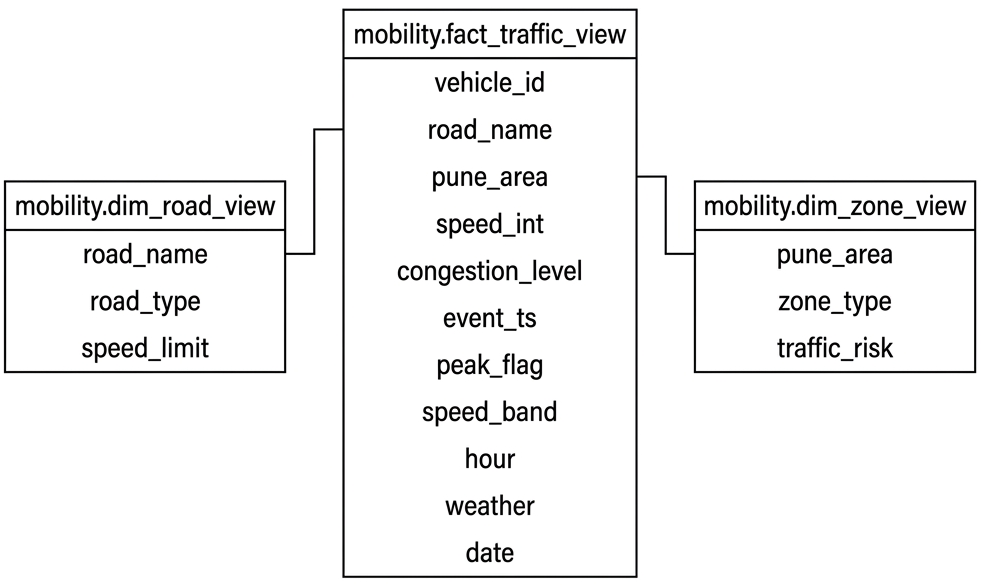

# PuneFlow Pipeline Commands

## 1. Docker Management
```powershell
docker compose up -d      # Start all services
docker ps                 # Check container status
docker compose logs -f    # Real-time logs
docker compose down       # Stop services (keeps data)
docker compose down -v    # Reset environment (wipes db/volumes)
```

## 2. Kafka Setup
```powershell
# Create topic (Remove -it if TTY error occurs)
docker exec -it kafka /opt/kafka/bin/kafka-topics.sh --create --topic pune-traffic-topic --bootstrap-server kafka:9092 --partitions 3 --replication-factor 1

# List topics
docker exec -it kafka /opt/kafka/bin/kafka-topics.sh --list --bootstrap-server kafka:9092

# Consume topic messages (verify pipeline)
docker exec -it kafka /opt/kafka/bin/kafka-console-consumer.sh --topic pune-traffic-topic --bootstrap-server kafka:9092 --from-beginning --max-messages 10
```

## 3. Traffic Producer
```powershell
pip install kafka-python faker pytz   # Install dependencies
python main.py                        # Run simulator (keep running)
```

## 4. Medallion Spark Jobs
*Note: Since the worker has 6 cores and 6GB RAM allocated, you can run all three layers concurrently in parallel (each job consumes 2 cores).*
```powershell
# Bronze
docker exec -it spark-worker /opt/spark/bin/spark-submit --packages io.delta:delta-spark_2.12:3.2.0,org.apache.spark:spark-sql-kafka-0-10_2.12:3.5.1 --conf spark.jars.ivy=/tmp/.ivy /opt/spark-apps/bronze_puneflow.py

# Silver
docker exec -it spark-worker /opt/spark/bin/spark-submit --packages io.delta:delta-spark_2.12:3.2.0,org.apache.spark:spark-sql-kafka-0-10_2.12:3.5.1 --conf spark.jars.ivy=/tmp/.ivy /opt/spark-apps/silver_puneflow.py

# Gold
docker exec -it spark-worker /opt/spark/bin/spark-submit --packages io.delta:delta-spark_2.12:3.2.0,org.apache.spark:spark-sql-kafka-0-10_2.12:3.5.1 --conf spark.jars.ivy=/tmp/.ivy /opt/spark-apps/gold_puneflow.py

# Reset checkpoints/state on error
Remove-Item -Recurse -Force ./warehouse/*
```

## 5. Hive Metastore Table Registration
```powershell
docker exec -it spark-worker bash    # Exec into spark worker container
```
```bash
# Inside container:
mkdir -p /tmp/spark-warehouse && chmod -R 777 /tmp/spark-warehouse

/opt/spark/bin/spark-sql --packages io.delta:delta-spark_2.12:3.2.0 --conf spark.jars.ivy=/tmp/.ivy --conf spark.sql.extensions=io.delta.sql.DeltaSparkSessionExtension --conf spark.sql.catalog.spark_catalog=org.apache.spark.sql.delta.catalog.DeltaCatalog --conf spark.sql.catalogImplementation=hive --conf spark.hadoop.hive.metastore.uris=thrift://hive-metastore:9083 --conf spark.sql.warehouse.dir=/tmp/spark-warehouse
```
```sql
-- Inside spark-sql CLI:
CREATE DATABASE IF NOT EXISTS mobility;
USE mobility;

CREATE TABLE IF NOT EXISTS fact_traffic USING delta LOCATION '/opt/spark/warehouse/fact_traffic';
CREATE TABLE IF NOT EXISTS dim_zone USING delta LOCATION '/opt/spark/warehouse/dim_zone';
CREATE TABLE IF NOT EXISTS dim_road USING delta LOCATION '/opt/spark/warehouse/dim_road';

CREATE OR REPLACE VIEW fact_traffic_view AS
SELECT
  CAST(vehicle_id AS STRING) AS vehicle_id,
  CAST(road_name AS STRING) AS road_name,
  CAST(pune_area AS STRING) AS pune_area,
  CAST(speed_int AS DOUBLE) AS speed_int,
  CAST(congestion_level AS INT) AS congestion_level,
  CAST(event_ts AS TIMESTAMP) AS event_ts,
  CAST(peak_flag AS INT) AS peak_flag,
  CAST(speed_band AS STRING) AS speed_band,
  CAST(hour AS INT) AS hour,
  CAST(weather AS STRING) AS weather,
  CAST(date AS DATE) AS date
FROM fact_traffic;

CREATE OR REPLACE VIEW dim_zone_view AS
SELECT
  CAST(pune_area AS STRING) AS pune_area,
  CAST(zone_type AS STRING) AS zone_type,
  CAST(traffic_risk AS STRING) AS traffic_risk
FROM dim_zone;

CREATE OR REPLACE VIEW dim_road_view AS
SELECT
  CAST(road_name AS STRING) AS road_name,
  CAST(road_type AS STRING) AS road_type,
  CAST(speed_limit AS INT) AS speed_limit
FROM dim_road;

SELECT COUNT(*) FROM fact_traffic_view;
exit;
```

## 6. Thrift JDBC Server
```bash
# Run inside spark-worker container:
cd /opt/spark/jars

# Fetch required dependencies
wget -q -N https://repo1.maven.org/maven2/io/delta/delta-spark_2.12/3.2.0/delta-spark_2.12-3.2.0.jar
wget -q -N https://repo1.maven.org/maven2/io/delta/delta-storage/3.2.0/delta-storage-3.2.0.jar

# Start thrift server in HTTP mode (highly recommended to bypass local SSL issues in Power BI)
/opt/spark/sbin/start-thriftserver.sh --master spark://spark-master:7077 --packages io.delta:delta-spark_2.12:3.2.0 --conf spark.jars.ivy=/tmp/.ivy --conf spark.sql.extensions=io.delta.sql.DeltaSparkSessionExtension --conf spark.sql.catalog.spark_catalog=org.apache.spark.sql.delta.catalog.DeltaCatalog --conf spark.sql.catalogImplementation=hive --conf spark.hadoop.hive.metastore.uris=thrift://hive-metastore:9083 --conf spark.sql.warehouse.dir=/opt/spark/warehouse --conf spark.hadoop.hive.server2.transport.mode=http --conf spark.hadoop.hive.server2.thrift.http.port=10000 --conf spark.hadoop.hive.server2.http.endpoint=cliservice --conf spark.cores.max=2

# Stop command when done
/opt/spark/sbin/stop-thriftserver.sh
```

## 7. Power BI Connection

* **Connector**: Spark
* **Server**: `http://localhost:10000/cliservice`
* **Protocol**: `HTTP`
* **Mode**: `DirectQuery` (or Import)
* **Credentials**: Choose **Username/Password** (user: `spark`, pass: `spark`)

### Load Data
* Load `fact_traffic_view`, `dim_zone_view`, `dim_road_view` and connect them in a star schema.


